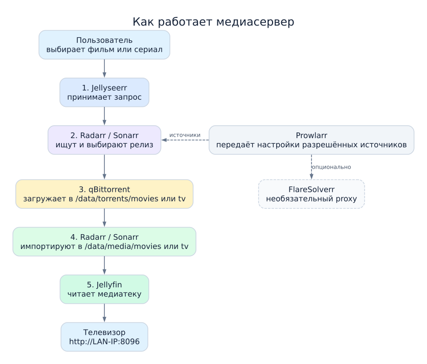

# Домашний медиасервер на Fedora 44

Идите по шагам сверху вниз. Каждый сервис настраивается один раз через браузер. Используйте только источники и материалы, к которым у вас есть право доступа.

## Структура проекта

```text
fedora-media-server/
├── README.md
├── compose.yaml
├── .env.example
├── .gitignore
├── config/
│   ├── qbittorrent/
│   ├── radarr/
│   ├── sonarr/
│   ├── prowlarr/
│   ├── jellyfin/
│   └── jellyseerr/
├── data/
│   ├── torrents/
│   │   ├── movies/
│   │   └── tv/
│   └── media/
│       ├── movies/
│       └── tv/
└── docs/
    ├── 01-installation.md
    ├── 02-qbittorrent.md
    ├── 03-prowlarr.md
    ├── 04-radarr.md
    ├── 05-sonarr.md
    ├── 06-jellyseerr.md
    ├── 07-jellyfin.md
    ├── 08-russian-audio.md
    ├── 09-rutracker-flaresolverr.md
    ├── service-flow.svg
    └── troubleshooting.md
```

Файл `.env` появится после шага 2. Папки `config/` и `data/` уже созданы; их содержимое и `.env` не попадают в Git.

## Схема работы сервисов



Основной путь на схеме идёт сверху вниз. Prowlarr передаёт Radarr/Sonarr настройки источников. FlareSolverr запущен, но используется Prowlarr только для индексатора с совпадающим тегом и при обнаружении Cloudflare.

## Последовательность действий

### 1. Установите Docker

На Fedora 44 установите Docker Engine и Compose по [официальной инструкции](https://docs.docker.com/engine/install/fedora/). После установки запустите службу:

```bash
sudo systemctl enable --now docker
```

Подробности: [установка на Fedora](docs/01-installation.md).

### 2. Подготовьте проект

В каталоге `fedora-media-server` создайте локальный файл настроек:

```bash
cp .env.example .env
id -u
id -g
```

Сравните числа из `id -u` и `id -g` с `PUID` и `PGID` в `.env`. Если отличаются — исправьте `.env`. Часовой пояс по умолчанию: `Europe/Berlin`.

### 3. Запустите сервисы

```bash
docker compose config -q
docker compose up -d
docker compose ps
```

В списке должны быть `qbittorrent`, `radarr`, `sonarr`, `prowlarr`, `jellyfin`, `jellyseerr`, `flaresolverr`. Если Docker требует права администратора, используйте `sudo docker compose` для этих команд. Если сервис не запустился: `docker compose logs --tail=100 <имя-сервиса>`.

### 4. Настройте qBittorrent

1. Откройте `http://localhost:8080`.
2. Временный пароль `admin` найдите через `docker compose logs qbittorrent`. Сразу смените его в настройках Web UI.
3. Задайте каталог загрузок `/data/torrents`.
4. Создайте категории `movies` → `/data/torrents/movies` и `tv` → `/data/torrents/tv`.

Подробнее: [qBittorrent](docs/02-qbittorrent.md).

### 5. Настройте фильмы и сериалы

| Сервис | Откройте | Корневая папка | Категория qBittorrent |
| --- | --- | --- | --- |
| Radarr — фильмы | `http://localhost:7878` | `/data/media/movies` | `movies` |
| Sonarr — сериалы | `http://localhost:8989` | `/data/media/tv` | `tv` |

В каждом сервисе добавьте **Download Client → qBittorrent**: хост `qbittorrent`, порт `8080`, логин и пароль из шага 4. Нажмите **Test**, затем сохраните. Подробнее: [Radarr](docs/04-radarr.md), [Sonarr](docs/05-sonarr.md).

### 6. Настройте Prowlarr и RuTracker.org

1. Откройте `http://localhost:9696`.
2. В **Settings → Apps** добавьте Radarr (`http://radarr:7878`) и Sonarr (`http://sonarr:8989`). API-ключ каждого сервиса берите в его **Settings → General**. Проверьте **Test**.
3. В **Settings → Indexer Proxies** добавьте **FlareSolverr**: Host `http://flaresolverr:8191`, Tags `rutracker`. Проверьте **Test**.
4. В **Indexers → Add Indexer** найдите **RuTracker.org**. Введите данные своей учётной записи в интерфейсе Prowlarr, добавьте тег `rutracker`, проверьте **Test** и сохраните.
5. Запустите синхронизацию индексаторов с Radarr/Sonarr в Prowlarr.

FlareSolverr работает внутри сети Docker; порт `8191` на хосте не открыт. Prowlarr использует его для индексатора с совпадающим тегом, когда распознаёт Cloudflare. Данные учётной записи, cookies и API-ключи не записывайте в репозиторий. Подробнее: [Prowlarr](docs/03-prowlarr.md), [RuTracker.org и FlareSolverr](docs/09-rutracker-flaresolverr.md).

### 7. Настройте Jellyfin

Откройте `http://localhost:8096`. В мастере добавьте две библиотеки: **Фильмы** → `/data/media/movies`, **Сериалы** → `/data/media/tv`. Подробнее: [Jellyfin](docs/07-jellyfin.md).

### 8. Настройте Jellyseerr

Откройте `http://localhost:5055`. Подключите Jellyfin по `http://jellyfin:8096`, Radarr по `http://radarr:7878`, Sonarr по `http://sonarr:8989`. API-ключи вводите только в интерфейсе. Для запросов выберите корневые папки из шага 5. Подробнее: [Jellyseerr](docs/06-jellyseerr.md).

### 9. Проверьте работу

Отправьте запрос на доступный вам материал в Jellyseerr. Проверьте: он появился в Radarr или Sonarr → задача ушла в qBittorrent → файл попал в `/data/media` → появился в Jellyfin. На телевизоре откройте `http://<LAN-IP-сервера>:8096`. Если ТВ не подключается, проверьте адрес сервера и доступ к `8096/tcp` в firewall: [диагностика](docs/troubleshooting.md).

## Адреса и данные

Внутри Docker сервисы обращаются друг к другу по именам `qbittorrent`, `radarr`, `sonarr`, `prowlarr`, `jellyfin`, `jellyseerr`, `flaresolverr`. В браузере Fedora используйте `localhost` и порт из соответствующего шага. На ТВ используйте LAN-IP Fedora-хоста. [Русская озвучка и Custom Formats](docs/08-russian-audio.md) настраиваются после проверки основного пути.

Для остановки: `docker compose down`. Настройки и медиаданные в `config/` и `data/` остаются на диске. Перед обновлением образов сохраните резервную копию этих каталогов.
