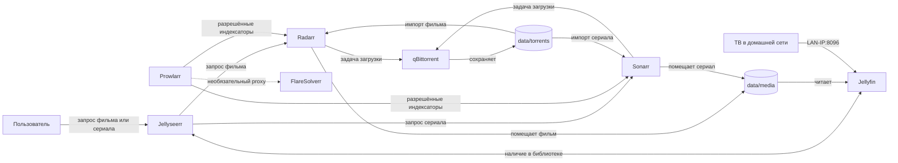

# Домашний медиасервер на Fedora 44

Документированный стек Docker Compose: Jellyseerr принимает запросы, Radarr и Sonarr управляют фильмами и сериалами, Prowlarr подключает разрешённые источники, qBittorrent загружает файлы, Jellyfin показывает библиотеку. FlareSolverr включается отдельным профилем при необходимости; инструкции по обходу ограничений сайтов здесь отсутствуют. Используйте только контент и источники, к которым у вас есть право доступа.

## Быстрый запуск

На Fedora 44 установите Docker Engine и плагин Compose по [официальной инструкции Docker](https://docs.docker.com/engine/install/fedora/), затем запустите службу. Подробности: [установка](docs/01-installation.md).

```bash
cp .env.example .env
id -u; id -g
docker compose config -q
docker compose up -d
docker compose ps
```

Если UID/GID отличаются от `1000`, измените `PUID`/`PGID` в `.env`. Запускайте команды из каталога проекта. Первый запуск скачает образы. `docker compose config -q` проверяет синтаксис, а не доступность образов или сервисов.

## Структура проекта

```text
fedora-media-server/
├── README.md
├── compose.yaml
├── .env.example
├── .gitignore
├── config/
│   ├── qbittorrent/
│   ├── radarr/
│   ├── sonarr/
│   ├── prowlarr/
│   ├── jellyfin/
│   └── jellyseerr/
├── data/
│   ├── torrents/
│   │   ├── movies/
│   │   └── tv/
│   └── media/
│       ├── movies/
│       └── tv/
└── docs/
    ├── 01-installation.md
    ├── 02-qbittorrent.md
    ├── 03-prowlarr.md
    ├── 04-radarr.md
    ├── 05-sonarr.md
    ├── 06-jellyseerr.md
    ├── 07-jellyfin.md
    ├── 08-russian-audio.md
    └── troubleshooting.md
```

Пустые каталоги `config/` и `data/` сохранены в Git файлами `.gitkeep`. Создаваемые сервисами настройки и медиаданные в Git не попадают. Локальный `.env` создаётся из `.env.example`.

## Схема взаимодействия



Prowlarr передаёт настройки разрешённых источников Radarr/Sonarr. qBittorrent сохраняет загрузки, Radarr/Sonarr импортируют их в библиотеку, Jellyfin читает готовые файлы. FlareSolverr выключен по умолчанию.

## Адреса

| Сервис | Браузер на хосте | Адрес внутри сети Compose |
| --- | --- | --- |
| qBittorrent | `http://localhost:8080` | `http://qbittorrent:8080` |
| Radarr | `http://localhost:7878` | `http://radarr:7878` |
| Sonarr | `http://localhost:8989` | `http://sonarr:8989` |
| Prowlarr | `http://localhost:9696` | `http://prowlarr:9696` |
| Jellyfin | `http://localhost:8096` | `http://jellyfin:8096` |
| Jellyseerr | `http://localhost:5055` | `http://jellyseerr:5055` |

`localhost` внутри контейнера указывает на этот же контейнер. Для ТВ используйте `http://<LAN-IP-сервера>:8096`; `localhost` на ТВ указывает на сам ТВ. Остальные веб-интерфейсы также доступны по LAN-IP и указанным портам, если сеть и firewall разрешают доступ. Не публикуйте панели администрирования в интернет без отдельной защиты.

## Порядок настройки

1. [qBittorrent](docs/02-qbittorrent.md): пароль, каталог `/data/torrents`, категории.
2. [Radarr](docs/04-radarr.md) и [Sonarr](docs/05-sonarr.md): корневые каталоги, клиент загрузки.
3. [Prowlarr](docs/03-prowlarr.md): разрешённые индексаторы и связь с Radarr/Sonarr.
4. [Jellyfin](docs/07-jellyfin.md): библиотеки фильмов и сериалов.
5. [Jellyseerr](docs/06-jellyseerr.md): связь с Jellyfin, Radarr и Sonarr.
6. [Русская озвучка](docs/08-russian-audio.md): профили и ограничения определения языка.

При проблемах: [диагностика](docs/troubleshooting.md).

## Данные и SELinux

```text
config/<service>/        настройки каждого сервиса
data/torrents/movies/    загрузки фильмов
data/torrents/tv/        загрузки сериалов
data/media/movies/      библиотека фильмов
data/media/tv/          библиотека сериалов
```

Radarr, Sonarr и qBittorrent видят общий путь `/data`; это помогает импорту и жёстким ссылкам на одном файловом разделе. Jellyfin получает только чтение `/data/media`. На Fedora `:Z` задаёт частную метку SELinux для каждой папки настроек, `:z` — общую метку для данных. Не переносите эти метки на системные каталоги. Содержимое `config/`, `data/` и локальный `.env` исключены из Git; отслеживаются только `.gitkeep`. Делайте резервные копии `config/`, `.env` и нужной части `data/` отдельно.

## Управление

```bash
docker compose logs --tail=100 radarr
docker compose pull
docker compose up -d
docker compose down
```

`down` останавливает контейнеры; каталоги на хосте остаются. Обновляйте образы осознанно и сохраняйте резервную копию настроек перед обновлением. FlareSolverr по умолчанию не запускается: `docker compose --profile flaresolverr up -d`; внутри сети доступен по `http://flaresolverr:8191`. В Compose его порт на хост не опубликован.

## Источники

[Установка Docker на Fedora](https://docs.docker.com/engine/install/fedora/), [тома Compose и SELinux](https://docs.docker.com/reference/compose-file/services/#volumes), [документация образа qBittorrent](https://docs.linuxserver.io/images/docker-qbittorrent/), [документация образа Jellyfin](https://docs.linuxserver.io/images/docker-jellyfin/).
